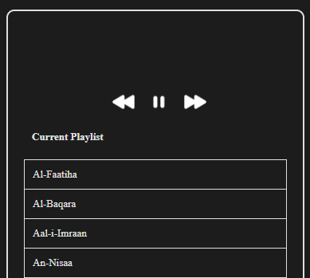

# Quran Recitation Player

Quran Recitation Player is a Visual Studio Code extension that allows you to play Quran recitations directly within your code editor. This extension provides an easy and convenient way to listen to Quran recitations while working on your projects.

## Features

- Play Quran recitations from various Surahs.
- Navigate through the playlist with next and previous buttons.
- Beautifully styled audio player with a dark mode theme.
- Easy-to-use controls for playing, pausing, and navigating recitations.

## Installation

1. Open Visual Studio Code.
2. Go to the Extensions view by clicking on the Extensions icon in the Activity Bar on the side of the window or by pressing `Ctrl+Shift+X`.
3. Search for "Quran Recitation Player".
4. Click "Install" to install the extension.

## Usage

1. Open the Command Palette (`Ctrl+Shift+P`).
2. Search for and select "Quran Recitation Player: Show Player".
3. The Quran Recitation Player will open in a new view.
4. Use the controls to play, pause, and navigate through the Quran recitations.

## Commands

- **Quran Recitation Player: Show Player** - Opens the Quran Recitation Player.

## Contributing

If you find any issues or have suggestions for new features, please open an issue or submit a pull request on [GitHub](https://github.com/fdciabdul/Quran-Player).

## License

This project is licensed under the MIT License - see the [LICENSE](LICENSE) file for details.

## Author

- **fdciabdul** - [GitHub](https://github.com/fdciabdul)

## Acknowledgements

- Thanks to the [IslamDownload](https://islamdownload.net) for providing the recitation audio files.
- Thanks to the [Quran API](https://api.quran.gading.dev) for providing the Surah data.

## Screenshots

